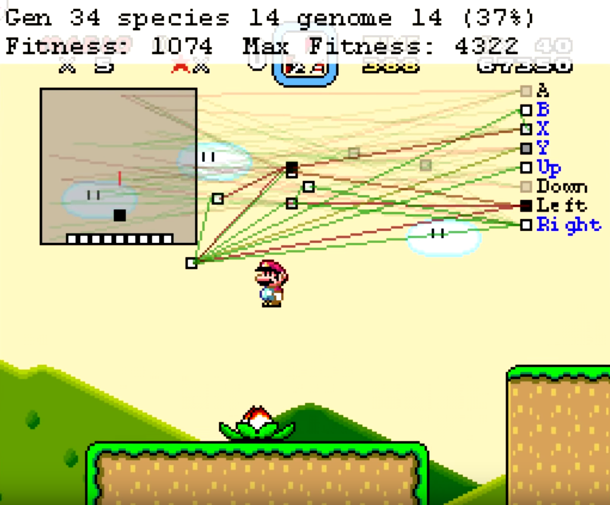
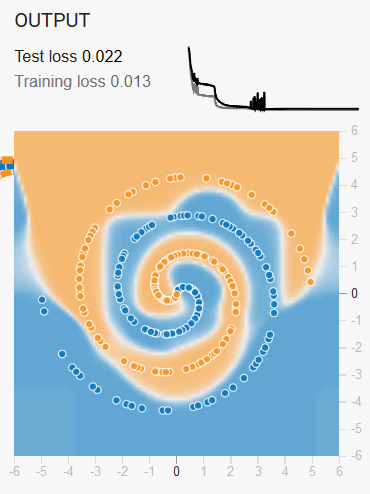
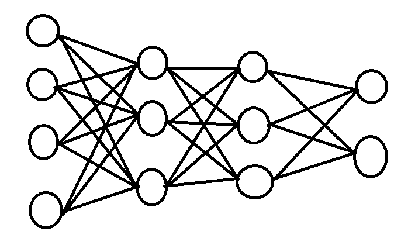
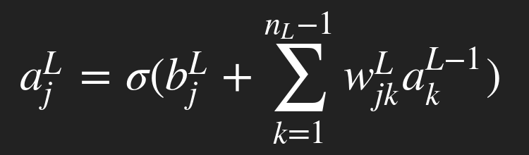
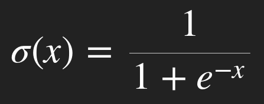
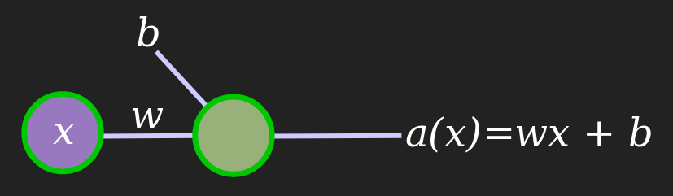
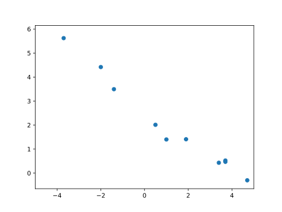
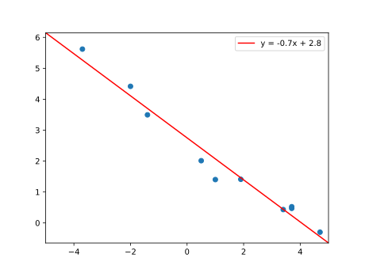
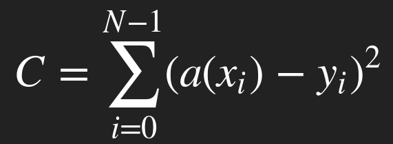
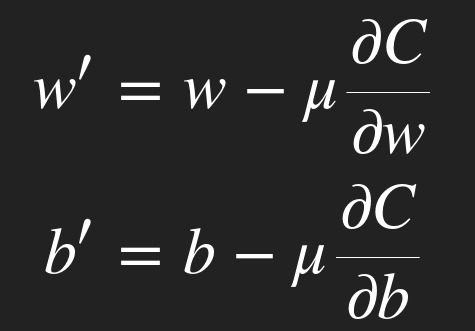

# Introduction to Machine Learning and Neural Networks

[](https://www.electricsquare.com/)

Brought to you by [Electric Square](https://www.electricsquare.com/).

Presented by [Tom Read Cutting](https://moosichu.github.io).

## Table of Contents

  - [Introduction](#introduction)
    - [Overview](#overview)
    - [Pre-Requisites](#pre-requisites)
      - [Aside: Why Python?](#aside-why-python)
  - [The Background](#the-background)
    - [What is machine learning?](#what-is-machine-learning)
    - [Types of machine learning](#types-of-machine-learning)
    - [Supervised Machine Learning](#supervised-machine-learning)
    - [Unsupervised Machine Learning](#unsupervised-machine-learning)
    - [Reinforcement Machine Learning](#reinforcement-machine-learning)
  - [The Theory](#the-theory)
    - [An Example of Neural Networks](#an-example-of-neural-networks)
    - [Neural Networks: A Trained Example](#neural-networks-a-trained-example)
      - [The parts of a neural network](#the-parts-of-a-neural-network)
    - [How to Train a Network: A Single Neuron](#how-to-train-a-network-a-single-neuron)
      - [The Maths of a Single Neuron](#the-maths-of-a-single-neuron)
      - [Finding *b* and *w*](#finding-b-and-w)
      - [Reducing the Cost](#reducing-the-cost)
      - [Working Through the Maths](#working-through-the-maths)
      - [Examples](#examples)
    - [Applying the Maths to a Full Network](#applying-the-maths-to-a-full-network)
  - [The Practice](#the-practice)
    - [The MNIST Dataset](#the-mnist-dataset)
    - [Training a Neural Network](#training-a-neural-network)
      - [Sorting the Project and Dependencies](#sorting-the-project-and-dependencies)
      - [Downloading the Dataset](#downloading-the-dataset)
      - [Training and evaluating a neural network](#training-and-evaluating-a-neural-network)
  - [The End](#the-end)
  - [Useful Resources](#useful-resources)
  - [Sources](#sources)

## Introduction

- **[Presentation](https://moosichu.github.io/introduction-to-neural-networks/presentation/index.html)**


### Overview

This workshop has 4 goals:

  - Introduce you to the wide and wonderful field of Machine Learning.
  - Explain the theory behind simple Neural Networks, one of the most popular machine learning algorithms out there.
  - Complete a fun neural network challenge: writing a neural network that can recognise handwritten digits from the [MNIST database](http://yann.lecun.com/exdb/mnist/).

    

  - Introduce you to a wide array of resources for further learning.

### Pre-requisites

You will need:

  - Python 3
  - A text editor

We will also download these libraries later:

  - [scikit-learn](https://scikit-learn.org/stable/)
  - [NumPy](http://www.numpy.org/)
  - [MNIST-for-Numpy](https://github.com/hsjeong5/MNIST-for-Numpy)


#### Aside: Why Python?

Python is an incredibly powerful interpreted language with many useful machine learning and visualization libraries that interact well with each other.

Furthermore, Python is widely used as a scripting language for other applications such as [Blender](https://www.blender.org/) and [Houdini](https://www.sidefx.com/). This allows Python and machine learning libraries to be used to greatly enhance those tools with relatively little effort. (eg. [Houdini](https://www.sidefx.com/) and [scikit-learn](https://scikit-learn.org) were used in conjuction to speed up development of [Spider-Man: Into the Spider-Verse](https://sidefx.com/community/spider-man-into-the-spider-verse/)).


> Machine learning allowed inking to be predicted for frames in Spider-Man, speeding up the workflow.

## The Background

### What is machine learning?

Machine Learning (ML) is a form of computation where programs are designed to solve specific tasks using models and inference, as opposed to relying on explicit hard-coded instructions.

Whilst this definition does not really help us understand anything about *how* machine learning works, it does allows us to see what makes it so *powerful*. Machine learning provides a set of techniques that allow us to solve problems that we wouldn't be able to solve otherwise with explicit instructions.

For example, no one knows how to write a face recognition algorithm, but we have been able to train machine learning algorithms to recognize faces for us.

### Types of machine learning

To better understand how machine learning works, we can divide it into three broad categories:

 1. Supervised Machine Learning
 2. Unsupervised Machine Learning
 3. Reinforcement Machine Learning

Many machine learning algorithms reside in one of these domains. However, some systems (such as neural networks) can be adapted for all three!

### Supervised Machine Learning

Supervised machine learning is when a machine learning algorithm attempts to infer a function from labeled training data. Language translation is a good example of this: You can train a machine learning algorithm to translate from one language to another by giving it inputs of one language which is labeled with translations into another language.

Once trained, you tell it to convert text it has never seen before from one language into another.

[This is how Google Translate works.](https://ai.googleblog.com/2016/11/zero-shot-translation-with-googles.html) However, it takes things to the *next level* by being able to translate between two languages it has never directly compared before.


> Although Google Translate learns how to translate between two languages by being trained on many examples, it can also translate between pairs it has never *directly* compared before. This is a very sophisticated real-world example of supervised machine learning.

Other examples of supervised machine learning include:

  - [The MNIST Database](http://yann.lecun.com/exdb/mnist/): A database of handwritten numbers and labels representing their semantic values.
  - [MariFlow](https://www.youtube.com/watch?v=Ipi40cb_RsI): An AI that can play Super Mario Kart that attempts to mimic humans who have played the game.
  - [TensorFlow Playground](https://playground.tensorflow.org): A toy example that you can play around with and train on labelled data.

### Unsupervised Machine Learning

Unsupervised machine learning is when a machine learning algorithm attempts to infer some kind underlying structure present in unlabelled data. We can take clustering as an example: You give your machine learning algorithm some data and it attempts to divide it into clusters based on patterns it sees in the data.

[*Generative adversarial networks (GANs)*](https://en.wikipedia.org/wiki/Generative_adversarial_network) are an exciting recent development in this category of machine learning. This is when two neural networks are used to *compete* with each other in order to improve themselves. For example. given many images that form some kind of distribution (eg. a bunch of faces), you have a *generator* which creates synthetic images which look authentic and a *discriminator* detects which ones are real and which ones are fake. Therefore as one improves, the other has to improve in order to keep up: as the generator becomes better at generating synthetic images, the discriminator has to become even better at detecting them, meaning the generator has to become even better at making them etc. The image below was generated by a GAN which was designed to generate faces using this very technique:


> More faces like this, which have been generated by a GAN, can be found at [thispersondoesnotexist.com](https://thispersondoesnotexist.com/).

Other examples of unsupervised learning include:

  - [Clustering Workout Sessions](https://towardsdatascience.com/k-means-in-real-life-clustering-workout-sessions-119946f9e8dd): An example of k-means clustering applied to workout sessions.
  - [CycleGan](https://arxiv.org/abs/1703.10593): A generic style-transfer algorithm that learns how to convert images from one category to another without paired examples. 
  - [Edmond de Belamy](https://en.wikipedia.org/wiki/Edmond_de_Belamy): A novel painting created by a GAN.

### Reinforcement Machine Learning

Reinforcement learning is when a machine learning algorithm seeks to take actions in order to maximize some kind of reward.

This is very applicable when it comes to teaching AI how to play games, with [MarI/O](https://www.youtube.com/watch?v=qv6UVOQ0F44) being a very good example of this. MarI/O is a machine learning program that is designed to play *Super Mario World* on the *SNES*. Here the reward was given by how far and how quickly Mario would travel right.



> MarI/O in action, a decision network has been developed over time by rewarding the machine learning algorithm based on how far Mario travels to the right.

Other examples of reinforcement machine learning include:

  - [Random Network Distillation](https://blog.openai.com/reinforcement-learning-with-prediction-based-rewards/): A machine learning algorithm capable of playing Montezuma's Revenge.
  - [AlphaGo](https://ai.googleblog.com/2016/01/alphago-mastering-ancient-game-of-go.html): DeepMind's algorithm capable of beating the best players in the world at Go is one of the most famous examples of machine learning.
  - [Unity ML-Agents Toolkit](https://github.com/Unity-Technologies/ml-agents): An open source toolkit for using machine learning within the Unity game engine.

## The Theory

Now that we have covered some background and given some basic information about the field of machine learning, let's move onto a concrete example of a machine learning algorithm: Neural Networks.

### An Example of Neural Networks

Although you have probably *heard* of neural networks at some point in your life by now if you are vaguely interested in computers, it's still a good idea to familiarize yourself with what they look like and how they behave before jumping into understanding what is going on under-the-hood.

Go to **[playground.tensorflow.org](https://playground.tensorflow.org)** and have a play around with the Neural Network there to get a feel for how they work. Don't worry about trying to understand what everything means, just get a feel for what kind of structure that we will be dealing with and then at the end of this workshop you will be able to come back to this example and *really* understand what is happening.

[](https://playground.tensorflow.org/#activation=tanh&regularization=L1&batchSize=10&dataset=spiral&regDataset=reg-plane&learningRate=0.01&regularizationRate=0.003&noise=0&networkShape=8,4&seed=0.79101&showTestData=false&discretize=false&percTrainData=50&x=true&y=true&xTimesY=false&xSquared=true&ySquared=true&cosX=false&sinX=false&cosY=false&sinY=false&collectStats=false&problem=classification&initZero=false&hideText=false)

> What kind of result can you achieve with the spiral?

### Neural Networks: A Trained Example

So now let's look at a neural network that has been trained to recognize images. For example, if given a handwritten number like this:


It would output the number '5'.

So, what is this network actually doing? We can imagine it as some kind of function, *f(* **x** *)*.

What is **x** in this case? It's a multi-dimensional vector of 784 values, each representing the value of a pixel in a 28 · 28 image.

#### The parts of a neural network

So what does this network actually look like? Something like this:



The above image is an example of a type of neural network called a *perceptron*. It is one of the very first types of neural networks ever designed, and one of the simplest in design.

So, what is actually going on here?

Data flows from left-to-right, so as you can see, we have neurons divided into multiple *layers*. The column on the left represents the *input layer*, where each 'neuron' represents our raw input. The column on the right is the *output layer*, with the neurons there representing our output. All other layers are known as *hidden layers*.

Perceptrons always have 1 input layer, 1 output layer and 0+ hidden layers. Also every neuron in a given layer is always connected to everyone neuron from the previous and subsequent layers. Other types of neural networks do not always have this property.

Finally, each connection has some kind of *weight*, so whilst every perceptron has the same layout given a number of layers and neurons, it's the values of the *weights* which determine what a network is capable. When a network *learns* it is setting the values of these weights so that it can complete the task at hand.

The value of the output of the *j*th neuron in a given layer *L* is:



Where *b<sup>L</sup><sub>j</sub>* is a bias and *a<sup>L-1</sup><sub>k</sub>* *w<sup>L</sup><sub>jk</sub>* represent the outputs of the previous layer being multiplied by their weights. Finally, a function *σ* is applied to the entire thing. This is called an *activation function*, but in this case we will be using the *sigmoid function*:



The sigmoid function restricts the range of the output to a value between 0 and 1:

 6 and to 0 at inputs < -6." width=400 />

So how would a perceptron recognize a number? Basically, the weights connecting the 784 input neurons to the final output are *somehow set through machine learning* so that the neural network will correct identify a number with a reasonable amount of accuracy.

How does this work? Let's look at a simple example.

### How to Train a Network: A Single Neuron

Let's look at a simple network with only a single neuron:




As you can see, it takes some input, *x*, multiplies it by a weight, *w*, and adds a bias *b*. We will ignore the idea of an activation function for now.

This simple 'network' can't really model much, but it should be able to handle the following data:

| $x$  | $y$  |
| ---- | ----:|
| -2.0 | 4.4  |
| 3.7  | 0.5  |
| 4.7  | -0.3 |
| 1.0  | 1.4  |
| 3.4  | 0.4  |
| 1.9  | 1.4  |
| 0.5  | 2.0  |
| 3.7  | 0.5  |
| -3.7 | 5.6  |
| -1.4 | 3.5  |



As you can see, we could fairly easily imagine a line-of-best fit passing through this data. Using linear-regression, you might get something like this:




However, we will use the neural-network method of learning here: *gradient descent*.

#### The Maths of a Single Neuron

As the diagram showed, this neural network can be modelled by the functions:

*a(x) = b + wx*

We can see how this could easily model our desired output function:

*y = c + mx*

#### Finding *b* and *w*

We need to a way to train the neural network so that it can calculate a weight and bias that will best fit the data. We can do this with a cost function:



Here, x<sub>i</sub> and y<sub>i</sub> each represent a sample from our training data. If we can find some general method that will automatically change *b* and *w* in order to *reduce the cost*, then we are chips and gravy.

#### Reducing the Cost

What devious trick can we use to reduce the cost? Calculus! Specifically, partial differentiation. If you don't know what that is, [here is some more information](https://www.math.hmc.edu/calculus/tutorials/partialdifferentiation/).

So, how can we use partial derivatives to reduce our cost? By finding the gradient of the cost function relative to a given weight or bias. Then, we can just nudge our cost *down* the gradient a *tiny bit*, theoretically making it a *bit* smaller. Voilà, now we have an improved weight and an improved bias value!


#### Working Through the Maths

So, what does the partial derivative actually like in practice? And how does it exactly help us improve *w* and *b*? Well, the equation below shows exactly how that happens:



Here μ represents the *little bit* we nudge *w* and *b* by in order to calculate their new values. We take the negative gradient as we want to *decrease* the cost.

#### Examples

Please look at [the slides showing how a network learns](https://moosichu.github.io/introduction-to-neural-networks/presentation/index.html#learning-factor-affects), in order to see how different learning factors affect how *w* and *b* are found.

Finding a good learning factor for a given problem is really a matter of trial and error, and it still a topic that is actively researched. As you can see, if your learning factor is too small, it can take many iterations before we converge on a solution! If it is too big, then we won't converge on anything at all.

### Applying the Maths to a Full Network

We can use the same cost function and similarly calculate its derivative w.r.t. all weights and biases.

This makes extensive use of the chain rule to backpropagate the cost through the network.

Some of the further reading links at the end show the full maths behind this.

## The Practice

We will now look at how to write a simple python script that trains and evaluates a neural network that can recognise handwritten digits.

### The MNIST Dataset

We will be training a neural network on the [MINST handwritten digit database](http://yann.lecun.com/exdb/mnist/), which has a pretty self-explanatory name.


It's a good problem for an introduction to machine learning. As the handwritten database has a lot of data in 60,000 training examples and 10,000 test examples, it is easier to train and verify the effectiveness of a machine learning algorithm. Furthermore, perceptrons can perform relatively well when it comes to this task - other tasks can require more advanced neural networks.

### Training a Neural Network

What we are going to be doing consists of three steps:

  - Setup the project folder and install Python dependencies
  - Download and load the dataset
  - Train and evaluate a neural network on the dataset

Everything will be explained below in a step-by-step process, however the final results of each step is given in the [examples folder](https://github.com/moosichu/introduction-to-neural-networks/tree/master/examples).


#### Sorting the Project and Dependencies

Create a folder and add a text file called `process_digits.py`.

Then, ensuring you have Python installed, run the following in the terminal or console:

```
pip install scikit-learn
pip install numpy
```

Now we have installed the machine learning library that we need and created a file to write our machine learning program.

#### Downloading the Dataset

For this step we will download the dataset that we will be training with: [the MNIST database](http://yann.lecun.com/exdb/mnist/). The setup you will have at the end of this step can be found in [examples/01_downloading_the_minst_database](https://github.com/moosichu/introduction-to-neural-networks/tree/master/examples/01_downloading_the_mnist_database).

We will use a handy library called [MNIST-for-Numpy](https://github.com/hsjeong5/MNIST-for-Numpy) to download the data for us and then use it to load the data into our program. 

Go to the [MNIST-for-Numpy](https://github.com/hsjeong5/MNIST-for-Numpy) GitHub repository to grab a copy of the `mnist.py` file. Put this file in the same directory you created `process_digits.py`. Open a terminal in this directory and run:

```bash
python minst.py
```

You should see:

```
Downloading train-images-idx3-ubyte.gz...
Downloading t10k-images-idx3-ubyte.gz...
Downloading train-labels-idx1-ubyte.gz...
Downloading t10k-labels-idx1-ubyte.gz...
Download complete.
Save complete.
```

This means that the library has downloaded the database for us. Now we can use it to load the database into our program. Just write the following in `process_digits.py`:

```python
import mnist

training_images, training_labels, test_images, test_labels = mnist.load()

print("We have successfully loaded the MNIST data!")
```

Then, run the following to confirm that everything has been successful:

```bash
python process_digits.py
```

You should see:

```
We have successfully loaded the MNIST data!
```

You can see how this all comes together in [examples/01_downloading_the_minst_database](https://github.com/moosichu/introduction-to-neural-networks/tree/master/examples/01_downloading_the_mnist_database).

Now we are ready to start training a neural network using this data!

#### Training and evaluating a neural network

For this step, we will be adding to our `process_digits.py` script in multiple steps to write a program that will train and evaluate a neural network. The result of this step is available in [examples/02_training_and_testing_the_network](https://github.com/moosichu/introduction-to-neural-networks/tree/master/examples/02_training_and_testing_the_network).

Now we are loading the data into the python script, we can feed it into a neural network by using **[scikit-learn](https://scikit-learn.org)**. Scikit-learn is a very powerful and user-friendly machine learning library for Python, with capabilities far beyond the realms of neural networks. It is itself a good source for learning about various machine learning algorithms.

So, let's go the [User Guide](https://scikit-learn.org/stable/user_guide.html) so we can explore how train a neural network on the data that we have.

We will be working with a supervised neural network, so we can open [the documentation for that](https://scikit-learn.org/stable/modules/neural_networks_supervised.html). Specifically, we would like to create [a classifier that classifies images as numbers](https://scikit-learn.org/stable/modules/neural_networks_supervised.html#classification).

The example there is useful for working out how to set things up, but it can be quite hard to work out what is going on. So we will jump to [the documentation for MLPClassifier](https://scikit-learn.org/stable/modules/generated/sklearn.neural_network.MLPClassifier.html#sklearn.neural_network.MLPClassifier), the class that we are about to use. Now you will hopefully recognise terms like `activation`, `hidden_layer`, `learning_rate` and more. A lot of these options are unfortunately out of scope for this workshop, and is one of the reasons why jumping into machine learning can be overwhelming. So let's configure the ones that we know about to turn our `process_digits.py` script into the following:


```python
import mnist
from sklearn.neural_network import MLPClassifier

training_images, training_labels, test_images, test_labels = mnist.load()

classifier = MLPClassifier(
  solver='sgd', # Use stochastic gradient descent solver
  activation="logistic", # Use the sigmoid activation function
  hidden_layer_sizes=(14, 14), # Set the hidden layer sizes 
  learning_rate='constant', # Set a constant learning rate
  learning_rate_init=0.01,  # Initialize the learning rate
  max_iter=100
)

classifier.fit(training_images, training_labels)

predicted_labels = classifier.predict(test_images)
```

We have some predictions! That's great. But how do we actually evaluate the quality of our neural network? By comparing the results of our predictions to the test_labels. So let's do that by adding this to our script:

```python
num_correct = 0
for predicted_label, test_label in zip(predicted_labels, test_labels):

  if predicted_label == test_label:
    num_correct = num_correct + 1

score = num_correct/len(predicted_labels)

print("We have a score of {}".format(score))
```

The full example script can be found in the example folder [examples/02_training_and_testing_the_network](https://github.com/moosichu/introduction-to-neural-networks/tree/master/examples/02_training_and_testing_the_network).

Now run `process_digits.py`:

```bash
python process_digits.py
```

This process can take a fair amount of time to complete. But once it finishes you should get something like the following as output:

```
We have a score of 0.8725
```

Now the question is, can you improve what we have done here?

<!-- TODO: write ideas for how to improve this score -->

## The End

And we are done (for now)! My plan is to the expand the content here based on feedback, but by now you should have enough knowledge to start diving into the [Useful Resources](#useful-resources). Trying going back to the [TensorFlow Playground](https://playground.tensorflow.org) and seeing what you now can understand. One of the big uncovered topics is [regularization](http://neuralnetworksanddeeplearning.com/chap3.html#overfitting_and_regularization), which I intend to add here in the near future. Feel free to ask any questions and give feedback as a [GitHub issue](https://github.com/moosichu/introduction-to-neural-networks/issues). You could also look at all the options in [the documentation for MLPClassifier](https://scikit-learn.org/stable/modules/generated/sklearn.neural_network.MLPClassifier.html#sklearn.neural_network.MLPClassifier) as a next step. I hope you found this useful!


## Useful Resources

  - [Neural Networks](https://www.youtube.com/watch?v=aircAruvnKk&list=PLZHQObOWTQDNU6R1_67000Dx_ZCJB-3pi) by 3blue1Brown
  - [Neural Networks and Deep Learning](http://neuralnetworksanddeeplearning.com/) by Michael Nielsen
  - [Machine Learning Course](https://www.coursera.org/learn/machine-learning) by Andrew Ng at Stanford
  - [scikit-learn user guide](https://scikit-learn.org/stable/user_guide.html)

## Sources

### Images

  - [The Logistics Curve](img/presentation/logistics_curve.png): [Wikimedia](https://en.wikipedia.org/wiki/Sigmoid_function#/media/File:Logistic-curve.svg)
  - [Perceptron Example](img/presentation/perceptron_example.png): [scikit-learn](https://scikit-learn.org/stable/_images/multilayerperceptron_network.png)
  - [The Number 5](img/presentation/5.png) and [MnistExamples](img/presentation/MnistExamples.png): [The MNIST Database](http://yann.lecun.com/exdb/mnist/)
  - [Google Translate Example](img/presentation/google-translate-example.gif): [Zero-Shot Translation with Google's Multilingual Neural Machine Translation System](https://ai.googleblog.com/2016/11/zero-shot-translation-with-googles.html)
  - [MarI/O Screenshot](img/presentation/marIO.png): [MarI/O](https://www.youtube.com/watch?v=qv6UVOQ0F44)
  - [Spider-Verse Inkline Example](img/presentation/spiderverse-inkline-exmple/jpg): [Spider-Man: Into the Spider-Verse](https://www.sidefx.com/community/spider-man-into-the-spider-verse/)
  - [playground.tensorflow.org spiral](img/presentation/playgruond_tensorflow_spiral.png): [playground.tensorflow.org](https://playground.tensorflow.org)
  - [fake person](img/presentation/fake-person.jpg): [thispersondoesnotexist.com](https://thispersondoesnotexist.com/)
