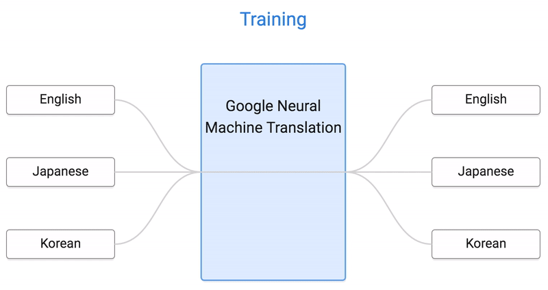
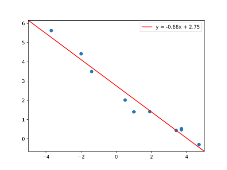

# Introduction to Machine Learning and Neural Networks

[](https://www.electricsquare.com/)

Brought to you by [Electric Square](https://www.electricsquare.com/).

Presented by [Tom Read Cutting](https://moosichu.github.io).

## Table of Contents

TODO

## Introduction

- **[Presentation](https://moosichu.github.io/introduction-to-neural-networks/presentation/index.html)**


### Overview

This workshop has 4 goals:

  - Introduce you to the wide and wonderful field of Machine Learning
  - Explain the theory behind simple Neural Networks, one of the most popular machine learning algorithms out there
  - Complete a fun neural network challenge: writing a neural network that can recognise handwritten digits from the [MNIST database](http://yann.lecun.com/exdb/mnist/).
    
  - Introduce you to a wide array of resources for further learning

### Pre-Requisites

You will need:

  - Python 3
  - A text editor

We will also download these libraries later:

  - [scikit-learn](https://scikit-learn.org/stable/)
  - [NumPy](http://www.numpy.org/)
  - [MNIST-for-Numpy](https://github.com/hsjeong5/MNIST-for-Numpy)


#### Aside: Why Python?

Basically, it is incredibly popular and widely used.

It is an incredibly powerful interpreted language with many useful machine learning and visualisation libraries that can interact well with each other.

Furthermore, Python is incredibly widely used as a scripting language for other applications such as [Blender](https://www.blender.org/) and [Houdini](https://www.sidefx.com/). This allows Python and machine learning libraries to be used to enhance those tools greatly with relatively little effort. (eg. [Houdini](https://www.sidefx.com/) and [scikit-learn](https://scikit-learn.org) were used in conjuction to speed up development of [Spider-Man: Into the Spider-Verse](https://sidefx.com/community/spider-man-into-the-spider-verse/)).


> Machine learning allowed inking to be predicted for frames in Spider-Man, speeding up the workflow.

## The Background

### What is machine learning?

Machine Learning (ML) is a form of computation where a program is designed to solve specific tasks using models and inference, as opposed to relying on explicit hard-coded instructions.

Whilst fairly easy to define, this doesn't really help understand anything about *how* machine learning works. However, it does help us understand what makes it so *powerful*. Essentially it means that forms of computation exist which allows us to solve problems that *to this day* we wouldn't be able to solve otherwise with explicit instructions.

No one knows how to write a 'recognize face' algorithm, but we have trained generic machine learning algorithms to recognize faces for us.

### Types of machine learning

To better understand how machine learning works, we can divide it into three broad categories:

 1. Supervised Machine Learning
 2. Unsupervised Machine Learning
 3. Reinforcement Machine Learning

Deciding which one of these can solve a given problem is a good way to narrow down which algorithm you may want to use. However, some systems (such as neural networks) can be adapted for all three!

### Supervised Machine Learning

Supervised machine learning is when a machine learning algorithm attempts to infer a function from labeled training data. A good example of this would be something like translation: you provide a machine learning algorithm with many equivalent pieces of text in two languages. Then, you tell it to convert text it has never seen before from one language into another. [This is how Google Translate works.](https://ai.googleblog.com/2016/11/zero-shot-translation-with-googles.html) However, it takes things to the *next level* by being able to translate between two languages it has never directly compared before.



> Although Google Translate learns how to translate between two languages by being trained on many examples, it can also translate between pairs it has never *directly* compared before. This is a very sophisticated real-world example of supervised machine learning.

Other examples of supervised machine learning include:

  - [The MNIST Database](http://yann.lecun.com/exdb/mnist/)
  - [MariFlow](https://www.youtube.com/watch?v=Ipi40cb_RsI)
  - [TensorFlow Playground](https://playground.tensorflow.org)

### Unsupervised Machine Learning

Unsupervised machine learning is when a machine learning algorithm attempts to infer some kind underlying structure present in unlabelled data. A good example of this is clustering: you give your machine learning algorithm some data and it attempts to divide it into clusters based on patterns it sees in the data.

However, one of the more exciting examples is [*generative adversarial networks*](https://en.wikipedia.org/wiki/Generative_adversarial_network). This is when two neural networks are used to *compete* with each other in order for them both to become something better. Given many images that form some kind of distribution (eg. a bunch of faces), you have a *generator* who's goal it is to generate synthetic images which look authentic and a *discriminator* who's goal it is to detect which ones are real and which ones are fake. Therefore as one improves, the other has to improve in order to keep up: as the generator becomes better at generating synthetic images, the discriminator has to become even better at detecting them, meaning the generator has to become even better at making them etc. The image below is an example of this:


> More faces like this, which have been generated by a neural network, can be found at [thispersondoesnotexist.com](https://thispersondoesnotexist.com/).

Other examples of unsupervised learning include:

  - [Clustering Workout Sessions](https://towardsdatascience.com/k-means-in-real-life-clustering-workout-sessions-119946f9e8dd)
  - [CycleGan](https://arxiv.org/abs/1703.10593)
  - [Edmond de Belamy](https://en.wikipedia.org/wiki/Edmond_de_Belamy)

### Reinforcement Machine Learning

Reinforcement learning is when a machine learning algorithm seeks to take actions in order to maximize some kind of reward.

This is very applicable when it comes to teaching AI how to play games, with [MarI/O](https://www.youtube.com/watch?v=qv6UVOQ0F44) being a very good example of this. MarI/O is a machine learning program that is designed to play *Super Mario World* on the *SNES*. Here the reward was given by how far and how quickly Mario would travel right.


> MarI/O in action, a decision network has been developed over time by rewarding the machine learning algorithm more the further to the right Mario gets.

Other examples of reinforcement machine learning include:

  - [Random Network Distillation](https://blog.openai.com/reinforcement-learning-with-prediction-based-rewards/)
  - [AlphaGo](https://ai.googleblog.com/2016/01/alphago-mastering-ancient-game-of-go.html)
  - [Unity ML-Agents Toolkit](https://github.com/Unity-Technologies/ml-agents)

## The Theory

Now that we have covered some background and given some basic information about the field of machine learning, lets move onto a concrete example of a machine learning algorithm: Neural Networks.

### An Example of Neural Networks

Although you have probably *heard* of neural networks at some point in your life by now if you are vaguely interested in computers, it's still a good idea to familiarize yourself with what they look like and how they behave before jumping into understanding what is going on under-the-hood.

Go to **[playground.tensorflow.org](https://playground.tensorflow.org)** and have a play around with the Neural Network there to get a feel for how they work. Don't about trying to understand what everything means, just get a feel for what kind of structure that we will be dealing with and then at the end of this workshop you will be able to come back to this page and *really* understand what is happening.

[](https://playground.tensorflow.org/#activation=tanh&regularization=L1&batchSize=10&dataset=spiral&regDataset=reg-plane&learningRate=0.01&regularizationRate=0.003&noise=0&networkShape=8,4&seed=0.79101&showTestData=false&discretize=false&percTrainData=50&x=true&y=true&xTimesY=false&xSquared=true&ySquared=true&cosX=false&sinX=false&cosY=false&sinY=false&collectStats=false&problem=classification&initZero=false&hideText=false)

> What kind of result can you achieve with the spiral?

### Neural Networks: A Trained Example

So now let's look at a neural network that has been trained to recognize images. For example, if given a handwritten number like this:


It would output the number '5'.

So, what is this network actually doing? We can imagine it as some kind of function, *f(* **x** *)*.

What is **x** in this case? It's a multi-dimensional vector of 784 values, each representing the value of a pixel in a 28 · 28 image.

#### The parts of a neural network

So what does this network actually look like? Something like this:


The above image is an example of a type of neural network called a *perceptron*. It is one of the very first types of neural networks ever designed, and one of the simplest in design.

So, what is actually going on here?

Data flows from left-to-right, so as you can see, we have neurons divided into multiple *layers*. The column on the left represents the *input layer*, where each 'neuron' represents our raw input. The column on the right is the *output layer*, with the neurons there representing our output. All other layers are known as *hidden layers*.

Perceptrons always have 1 input layer, 1 output layer and 0+ hidden layers. Also every neuron in a given layer is always connected to everyone neuron from the previous and subsequent layers. Other types of neural networks do not always have this property.

Finally, each connection has some kind of *weight*, so whilst every perceptron has the same layout given a number of layers and neurons, it's the values of the *weights* which determine what a network is capable. When a network *learns* it is setting the values of these weights so that it can complete the task at hand.

The value of the output of the *j*th neuron in a given layer *L* is:


Where *b* is a bias and the *a*s & *w*s represent the outputs of the previous layer multiplied by some weights. Finally, a function *σ* is applied to the entire thing (more on that later). This is called an *activation function*, but in this case we will be using the *sigmoid function*:


The sigmoid function restricts the range of the output to a value between 0 and 1:


So how would a perceptron recognize a number? Basically, the weights connecting the 784 input neurons to the final output are *somehow set through machine learning* so that the neural network will correct identify a number with a reasonable amount of accuracy.

How does this work? Let's look at a simple example.

### How to Train a Network: A Single Neuron

Let's look at a simple network with only a single neuron:


As you can see, it takes some input, *x*, multiplies it by a weight, *w*, and adds a bias *b*.

This simple 'network' can't really model much, but it should be able to handle the following data:

| $x$  | $y$  |
| ---- | ----:|
| -2.0 | 4.4  |
| 3.7  | 0.5  |
| 4.7  | -0.3 |
| 1.0  | 1.4  |
| 3.4  | 0.4  |
| 1.9  | 1.4  |
| 0.5  | 2.0  |
| 3.7  | 0.5  |
| -3.7 | 5.6  |
| -1.4 | 3.5  |


As you can see, we could fairly easily imagine a line-of-best fit passing through this data. Using linear-regression, you might get something like this:




However, we will use the neural-network method of learning here: *gradient descent*.

#### The Maths of a Single Neuron

As the diagram showed, this neural network can be modelled by the functions:

*a(x) = b + wx*

We can see how this could easily model our desired output function:

*y = c + mx*

#### Finding *b* and *w*

We need to a way to train the neural network so that it can calculate a weight and bias that will best fit the data. We can do this with a cost function:

TODO: Add cost function

Here, TODO XI YI each represent a sample from our training data. If we can find some general method that will automatically change *b* and *w* in order to *reduce the cost*, then we are chips and gravy.

#### Reducing the Cost

What devious trick can we use to reduce the cost? Calculus! Specifically, partial differentiation. If you don't know what that is, then TODO: Explanation.

So, how can we use partial derivatives to reduce our cost? By finding the gradient of the cost function relative to a given weight or bias. Then, we can just nudge our cost *down* the gradient a *tiny bit*, theoretically making it a *bit* smaller. Voila (TODO: accents), now we have an improved weight and an improved bias value!

TODO: grab equations from presentation.

#### Working Through the Maths

TODO: Adapt from presentation

#### Examples

Please look at the slides found TODO (link to anchor in slides), in order to see how different learning factors affect how *w* and *b* are found.

Finding a good learning factor for a given problem is really a matter of trial and error, and it still a topic that is actively researched. As you can see, if your learning factor is too small, it can take many iterations before we converge on a solution! If it is too big, then we won't converge on anything at all.

### Applying the Maths to a Full Network

We can use the same cost function and similarly calculate its derivative w.r.t. all weights and biases.

This makes extensive use of the chain rule to backpropagate the cost through the network.

Some of the further reading links at the end show the full maths behind this.

## The Practice

TODO: Write overview of section

### The MNIST Dataset

We will be training a neural network on the [MINST handwritten digit database](http://yann.lecun.com/exdb/mnist/), which has a pretty self-explanatory name.


It's a good problem for an introduction to machine learning. As the handwritten database has a lot of data in 60,000 training examples and 10,000 test examples, it is easier to train and verify the effectiveness of a machine learning algorithm. Furthermore, perceptrons can perform relatively well when it comes to this task - other tasks can require more advanced neural networks.

### Training a Neural Network

What we are going to be doing consists of three steps:

  - Setup the project folder and install Python dependencies
  - Download and load the dataset
  - Train and evaluate a neural network on the dataset


#### Sorting the Project and Dependencies

Create a folder and add a text file called `process_digits.py`.

Then, ensuring you have Python installed, run the following in the terminal or console:

```
pip install scikit-learn
pip install numpy
```

#### Downloading the Dataset

The dataset can be found at [yann.lecun.com/exdb/mnist/](http://yann.lecun.com/exdb/mnist/).

However, we will be using a handy library called [MNIST-for-Numpy](https://github.com/hsjeong5/MNIST-for-Numpy) to download and then load the data into `process_digits.py`.

Download the dataset is really straightforward, all we need to do is put a copy of the `mnist.py` file in the same directory as `process_digits.py`. Then, just write the following in `process_digits.py`:

```python
import mnist

training_images, training_labels, test_images, test_labels = mnist.load()

print("We have successfully loaded the MNIST data!")
```

Then, run the following in the terminal:

```bash
python minst.py
```

You should see:

```
Downloading train-images-idx3-ubyte.gz...
Downloading t10k-images-idx3-ubyte.gz...
Downloading train-labels-idx1-ubyte.gz...
Downloading t10k-labels-idx1-ubyte.gz...
Download complete.
Save complete.
```

Then, to confirm everything has been successful run:

```bash
python process_digits.py
```

You should see:

```
We have successfully loaded the MNIST data!
```

You can see what this all looks like in the example folder [examples/01_downloading_the_minst_database](https://github.com/moosichu/introduction-to-neural-networks/tree/master/examples/01_downloading_the_mnist_database).

Now we are ready to start training a neural network using this data!

#### Training and evaluating a neural network

Let's look at how to do this: TODO:

## Useful Resources

  - [Neural Networks](https://www.youtube.com/watch?v=aircAruvnKk&list=PLZHQObOWTQDNU6R1_67000Dx_ZCJB-3pi) by 3blue1Brown
  - [Neural Networks and Deep Learning](http://neuralnetworksanddeeplearning.com/) by Michael Nielsen
  - [Machine Learning Course](https://www.coursera.org/learn/machine-learning) by Andrew Ng at Stanford
  - [scikit-learn user guide](https://scikit-learn.org/stable/user_guide.html)

## Sources

TODO: Sources and attribution


### Images

 - [The Logistics Curve](img/presentation/logistics_curve): [Wikimedia](https://en.wikipedia.org/wiki/Sigmoid_function#/media/File:Logistic-curve.svg)
